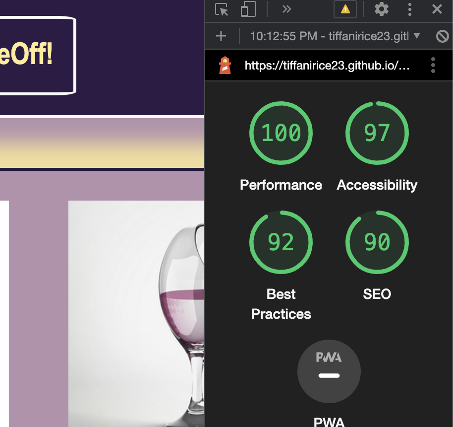

# odd-duck

# LAB 11

## odd-duck

I build an app with a direct and powerful purpose. It does all of the things that it accomplishes well. I should describe the purpose and functionality so those that visit my README understand the app

### Author: Tiffani Rice
Dan Quinn for JS issues

### Links and Resources

* [submission PR](http://xyz.com)
* Any Links you used as reference

### Lighthouse Accessibility Report Score

- Lab11

* Provide a screenshot of your score after running a Lighthouse Accessibility report.

- Lab12

- Lab13

- Lab15b

### Overview of the Odd Duck project

This application allows users to view a selection of 3 odd product images, and vote on their favorite of the three. Local storage ensures that their answers are saved, and refresshing the broswer will not lose the data. The user is able to click a "view results" button at any point to see their votes/ views! After 25 clicks, a graph will appear that shows a final tally.
